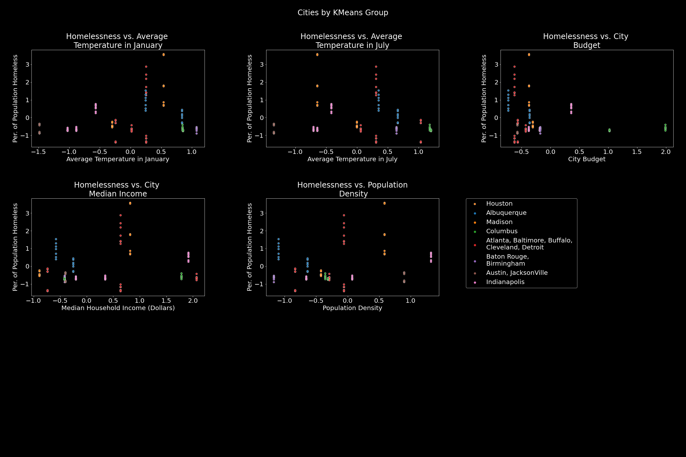

# Project 5 Homelessness in America

# Contents

1. [Introduction and Goals](#Introduction-and-Goals)
2. [Data Cleaning and EDA of Homelessness counts and Housing Inventory counts](#Data-Cleaning-and-EDA-of-Homelessness-and-Housing-Inventory-counts)
3. [Linear Regression with Housing Costs and Income data](#Linear-Regression-with-Housing-Costs-and-Income-data) 
4. [KMeans Clusters with Weather and Population data](#KMeans-Clusters-with-Weather-and-Population-data)
5. [Conclusions and TODO](#Conclusions-and-TODO)

# Introduction and Goals

This project was a joint effort by Andrew Gossage, Suma Karanam and Eric Swanson and involved reasearching the state of homelessness in USA

## Goals
- Identify if there are any determinants of homelessness at the city level
- Compare cities with similar features but different trends in homelessness to identify mitigating factors
- Present areas of focus that aid in fighting homelessness

# Data Cleaning and EDA of Homelessness and Housing Inventory counts

## The Homeless counts Data

The department of Housing and Urban Development (HUD) publishes counts of sheltered and unsheltered homeless populations  every year ([source](https://www.hudexchange.info/programs/coc/coc-homeless-populations-and-subpopulations-reports/)). These counts are based on Point-in-Time (PIT) information provided to HUD by Continuum of Care (CoC) Homeless Assistance Programs  in the application for CoC Homeless Assistance Programs. The PIT Count provides a count of sheltered and unsheltered homeless persons on a single night during the last ten days in January for each CoC.

### Data Cleaning

The PIT estimates for the years for the years 2014 to 2020 were obtained from the reports published by the HUD. These reports contain the counts of homeless for each CoC. Data cleaning involved gathering information about the city served by the CoC from separate tables from the HUD's website, merging this with the PIT estimates data and then aggregating these counts at the city level for each year between 2014 to 2020. The details of this data processing can be found in this [notebook](https://github.com/AndrewGossage/Project5/blob/master/data/homelessness/homelessness_cleaning/PIT%20and%20HIC%20Data%20Cleaning.ipynb)

The tables containing the aggregated information for PIT estimates along with the cities served by each CoC for all years from 2014 to 2019 can be downloaded from [here](https://github.com/AndrewGossage/Project5/blob/master/data/homelessness/homelessness_cleaning/2014-2021-PIT-esimates-cleanish.csv)

HUD also publishes the Housing Inventory Count (HIC) which is the number of housing units (both permanent and transitional) provided by each CoC. This data was also cleaned and merged with the city data of each CoC and can be downloaded from [here](https://github.com/AndrewGossage/Project5/blob/master/data/homelessness/homelessness_cleaning/2014-2021-HIC-cleanish.csv)

### EDA

In 2020, a little over half a million people (574577) were homeless in the US. The states with the highest numbers of homeless population are

| State      | Homeless population |
|------------|---------------------|
| California | 161548              |
| New York   | 91271               |
| Texas      | 27229               |
| Florida    | 25977               |
| Washington | 22923               |

### Change in homelessness counts over the last decade

EDA with the homeless counts and inventory counts involved looking at the trends in the raw counts and the counts normalized with respect to the population for various cities between 2014 and 2020. Complete details of the analysis can be found in this [notebook](https://github.com/AndrewGossage/Project5/blob/master/data/homelessness/homelessness_cleaning/EDA%20of%20homless%20counts.ipynb). The population data for this period obtained from [US Census Bureau](https://www.census.gov/data/tables/time-series/demo/popest/2010s-total-cities-and-towns.html) and a copy can be downloaded from [here](https://github.com/AndrewGossage/Project5/blob/master/data/homelessness/Population.xlsx). Included below are the trends for a few major metropolitan centers in the US

# Linear Regression with Housing Costs and Income data

## Software needed

pandas, matplotlib, seaborn, sklearn 

 ## Data Collection

The US Census department collects data on income and costs for both renters and homeowners down to the city level.  This data was very detailed and had the breakdown for the number of residents in 10,000 intervals for income and 300 intervals for costs.  For this study we just used the median for the years 2017 to 2019

https://data.census.gov

| Features                | Description                       |
|-------------------------|-----------------------------------|
| Median household Income | Median Income for the entire city |
| Median household Cost   | Median cost for the entire city   |
| Owner Occupied Income   | Median income for property owners |
| Owner Occupied Cost     | Median cost for property owners   |
| Renter Occupied Income  | Median income for renters         |
| Renter Occupied Cost    | Median cost for renters           |

## EDA

The next step was to look for trends in the data

What was Interesting about this was we could start to see a trend (a sort of triangular shape) in the main clustering of the data.  Upon discussion with the team this was found to correlate with some of their findings and on the plot to the right the center of the cluster was around 60,000 which is also the median income in the US.

The next step was building a Linear Regression model.  We chose Linear Regression for its simplicity and wanted easily interpretable features.  Although our model was a poor fit with an R^2 score of 33% we were able to see that the rental cost stood out as a large feature.  We took this information and started the next part of the research.

In our research we found an interesting article by Continum of Care outlining how cities are dealing with homeless and places that have had success and those that have not.  The article pointed out that when a city surpasses a rental cost to income ratio of 32% the city can start experiencing chronic homelessness.  So we created a column of this ratio and looked at cities above that ratio and compared it to our homeless counts.

https://dupagehomeless.org/research-demonstrates-connection-between-housing-affordability-homelessness/

Although we tried to match our data to what the research had said we were unable to.  We could not identify a direct tie between the increasing rental ratio and increasing homelessness.  This was also a good indication of how complex this problem is for America and that there is not an easy solution.

-------

The article mentioned my current city as a success story and so I investigated further as to why Houston had experienced success.  The two big takeaways from the article:

- Development of the HMIS system (an integrated system that coordinates community involvement and departments across the city.

- Trying to find more permanent housing than temporary

https://www.texastribune.org/2019/07/02/why-homelessness-going-down-houston-dallas/

# KMeans Clusters with Weather and Population data

<h2>Data Used</h2>
    <li>http://www.citymayors.com/society/usa-cities-homelessness.html</li>
    <li>https://www.infoplease.com/math-science/weather/climate-of-100-selected-us-cities</li>
    <li>https://www.huduser.gov/portal/datasets/ahar/2020-ahar-part-1-pit-estimates-of-homelessness-in-the-us.html?utm_source=HUD+Exchange+Mailing+List&utm_campaign=ca0950288a-hud_releases_2020_annual_homeless_assessment&utm_medium=email&utm_term=0_f32b935a5f-ca0950288a-19646315</li>
<h2>Methodology</h2>
    
Data was pulled on enviroment and population density and then merged with homeless counts and income data data. Scatter plots and heatmaps were used to examine correlation of datapoint with overall homeless population numbers and percentage of total population living without a home. Cities had multiple years of economic data along with homeless data and enviromental data matched with them and these were plugged into a KMeans model to group cities as a launch point for city comparison.

<h2>Notable File Locations</h2>
    <li>Data and cleaning notbook  -> /data/weather-population</li>
    <li>EDA  -> /primary-code</li>
<h2>Data Dictionary</h2>    

<table class="tableizer-table">
<thead><tr class="tableizer-firstrow"><th></th><th>Variable</th><th> Explanation</th></tr></thead><tbody>
 <tr><td>1</td><td>group</td><td> KMeans Model Group</td></tr>
 <tr><td>2</td><td>jan</td><td> Avg Temperature in January</td></tr>
 <tr><td>3</td><td>april</td><td> Avg Temperature in April</td></tr>
 <tr><td>4</td><td>july</td><td> Avg Temperature in July</td></tr>
 <tr><td>5</td><td>oct</td><td> Avg Temperature in October</td></tr>
 <tr><td>6</td><td>precip "</td><td> Inches of rainfall </td></tr>
 <tr><td>7</td><td>precip days</td><td> Days with rain</td></tr>
 <tr><td>8</td><td>snowfall</td><td> Inches of Snow</td></tr>
 <tr><td>9</td><td>rank</td><td> City ranking by size</td><td>&nbsp;</td></tr>
 <tr><td>10</td><td>pop2021</td><td> Population</td><td>&nbsp;</td></tr>
 <tr><td>11</td><td>pop2010</td><td> Population</td><td>&nbsp;</td></tr>
 <tr><td>12</td><td>aland_sqmi</td><td>Land Area</td></tr>
 <tr><td>13</td><td>2010 population</td><td> Population</td></tr>
 <tr><td>14</td><td>2012 population</td><td> Population</td></tr>
 <tr><td>15</td><td>population (2013)</td><td>Population</td></tr>
 <tr><td>17</td><td>density</td><td>Population Density</td></tr>
 <tr><td>18</td><td>growth / decline</td><td> Population growth</td>
 <tr><td>19</td><td>budget</td><td> City Budget</td><td>&nbsp;</td></tr>
 <tr><td>20</td><td>took office</td><td> Year Current Mayor took office</td></tr>
 <tr><td>21</td><td>term ends</td><td> Year Current Mayor will leave office</td></tr>
 <tr><td>22</td><td>overall homeless</td><td> Number of homeless in city</td></tr>
 <tr><td>23</td><td>year</td><td> year considered</td></tr>
 <tr><td>24</td><td>median household income (dollars)</td><td> Median household income</td><td>&nbsp;</td></tr>
 <tr><td>25</td><td>budget/pop</td><td> Budget divided by population</td></tr>
 <tr><td>26</td><td>budget/homeless</td><td> Budget divided by total homeless in city</td><td>&nbsp;</td></tr>
 <tr><td>27</td><td>%homeless</td><td> Percent of city living without a home</td></tr>
</tbody></table>
<h2>Model Groupings</h2>

Data in Columns is in standard deviations from the mean.

<table class="tableizer-table">
<thead><tr class="tableizer-firstrow"><th></th><th>jan</th><th>april</th><th>july</th><th>oct </th><th>precip "</th><th>precip days</th><th>snowfall</th><th>rank</th><th>pop2021</th><th>pop2010</th><th>growth</th><th>density</th><th>aland_sqmi</th><th>2010 population</th><th>2012 population</th><th>growth / decline</th><th>rank_y</th><th>population (2013)</th><th>budget</th><th>took office</th><th>term ends</th><th>overall homeless</th><th>year</th><th>median household income (dollars)</th><th>budget/pop</th><th>budget/homeless</th><th>%homeless</th></tr></thead><tbody>
 <tr><td>0</td><td>-1.1299525631588259</td><td>-1.0788617659458726</td><td>-0.8974699395752151</td><td>-1.0273355841851608</td><td>-0.06821926258499103</td><td>0.691229087532018</td><td>0.687695328344358</td><td>-0.7556566986063858</td><td>0.2968772367557819</td><td>0.32653064857399283</td><td>-0.006882638197611384</td><td>0.10505193169721212</td><td>0.10516961305053633</td><td>0.32792474256937965</td><td>0.3165402267860373</td><td>-0.02002535263995121</td><td>-0.7789403242149152</td><td>0.31136761491444104</td><td>-0.37797269118188753</td><td>-0.9721299240564192</td><td>0.7807507850863389</td><td>-0.2725913022258261</td><td>0.0</td><td>-0.08389648873153921</td><td>-0.9276771645523532</td><td>-0.3955057658402111</td><td>-0.6709347130120678</td></tr>
 <tr><td>1</td><td>0.5434714878476231</td><td>0.6288540643977291</td><td>0.5074156966059876</td><td>0.5015675346345079</td><td>1.3710741816895187</td><td>0.17820749912934836</td><td>-0.7107901749667345</td><td>2.3937581324980814</td><td>-0.9552552670960216</td><td>-0.9349474270638851</td><td>-1.193277397510832</td><td>-0.8665799552400969</td><td>-0.5291491864579319</td><td>-0.9299055608383487</td><td>-0.9331209474565961</td><td>-0.7665015472936646</td><td>2.2455736775224273</td><td>-0.9319378875824139</td><td>-0.5462526783342831</td><td>0.31215181047683455</td><td>-0.33714238446925104</td><td>-0.642608496323548</td><td>0.0</td><td>-0.4141368890970322</td><td>1.129529341316958</td><td>-0.039650311436125726</td><td>0.4975827835944004</td></tr>
 <tr><td>2</td><td>0.17613450104132958</td><td>0.24646986323052214</td><td>0.22781929235370826</td><td>0.036063512424050134</td><td>0.6163985893430555</td><td>0.20520863536106781</td><td>-0.5782563338968588</td><td>-0.13946684034681625</td><td>-0.3151906806269115</td><td>-0.44286095179152707</td><td>1.3951107626557784</td><td>-0.13546294537287124</td><td>-0.39660338738675127</td><td>-0.4550254343333161</td><td>-0.4210666787094413</td><td>0.4489933461873316</td><td>0.06231522593719328</td><td>-0.4159995545025179</td><td>-0.5584511402850681</td><td>0.633222244110148</td><td>-0.8162394571359325</td><td>-0.17520732598215577</td><td>0.0</td><td>1.1155431749328877</td><td>-0.7326940346235202</td><td>0.01927313752693091</td><td>0.0020137041765591955</td></tr>
 <tr><td>3</td><td>0.9661065156785199</td><td>1.067294588249134</td><td>0.921632591794547</td><td>1.0845152321732934</td><td>0.25120648183532823</td><td>-0.29161227130257006</td><td>-0.7325170341585174</td><td>-1.09798439763948</td><td>1.280994340963195</td><td>1.1641228768887133</td><td>0.8586091151519898</td><td>-0.7423517522251247</td><td>2.3704043318649264</td><td>1.1623921625926574</td><td>1.1749555194372798</td><td>1.1562899017245105</td><td>-1.1595083111884879</td><td>1.1741818856078077</td><td>0.42330459262148473</td><td>0.07134898525184946</td><td>0.14195468819743032</td><td>0.19478192436341585</td><td>0.0</td><td>-0.4150891132364906</td><td>-0.601912328259135</td><td>-0.12759814823115695</td><td>-0.7016380631596253</td></tr>
 <tr><td>4</td><td>0.8476107134829416</td><td>1.1513790722754316</td><td>1.180518151287399</td><td>1.154981437370288</td><td>-0.3810734266645546</td><td>-0.7452313599954568</td><td>-0.7086174890475563</td><td>-1.09798439763948</td><td>0.7585168357532186</td><td>0.4989144316584758</td><td>1.8579681814451277</td><td>-0.35541493495759957</td><td>0.6519276786638579</td><td>0.4658696409812462</td><td>0.5412689399597965</td><td>2.0953083949525535</td><td>-1.099418629034766</td><td>0.6147391484271655</td><td>1.9929380099032188</td><td>-0.16945383997313562</td><td>0.14195468819743032</td><td>0.07243020557348455</td><td>0.0</td><td>1.784684680932281</td><td>1.726839929732074</td><td>1.3388616511893605</td><td>-0.5891972803464521</td></tr>
 <tr><td>5</td><td>-0.0002925822276432695</td><td>-0.03381175019046791</td><td>0.131168683476378</td><td>-0.01945531591297654</td><td>-1.1116923409778932</td><td>-1.2420522666590947</td><td>-0.4406528923489004</td><td>-0.11664499374460996</td><td>-0.3446758163768654</td><td>-0.3275021046769253</td><td>-0.15933307427469817</td><td>-0.223245202982766</td><td>-0.2708412039317479</td><td>-0.3240333724915074</td><td>-0.3307743016431005</td><td>-0.3974445675509736</td><td>-0.057864138370250784</td><td>-0.3330965672805513</td><td>-0.41471504645533636</td><td>0.15161659366017782</td><td>0.4613527366418846</td><td>-0.04102142815658764</td><td>0.2857142857142857</td><td>-0.26812918771341454</td><td>-0.35710069306995024</td><td>0.08308643819164604</td><td>0.22860612252009785</td></tr>
 <tr><td>6</td><td>-0.56643919271763</td><td>-0.6624433688632588</td><td>-0.4142168951885608</td><td>-0.792448233528508</td><td>0.2026237271733102</td><td>0.22680954434644338</td><td>0.18652910965389918</td><td>-0.3790962296699822</td><td>-0.17592032822123377</td><td>0.04510343571876726</td><td>-1.529322207509196</td><td>1.3246438791044743</td><td>-0.7339362877200243</td><td>0.05063800642772858</td><td>0.016432785816442447</td><td>-0.7556086356928121</td><td>-0.538581595600027</td><td>0.0020169262703757587</td><td>0.35981380270896507</td><td>1.0345602861517897</td><td>1.1001488335307932</td><td>0.31143311771469323</td><td>0.0</td><td>1.9158195481376914</td><td>1.0785951413478962</td><td>-0.21608992232275295</td><td>0.5414275533525449</td></tr>
</tbody></table>
</img>
<h2></h2>

# Conclusions and TODO

## Conclusions

During our research we failed to find a universal solve for homelessness, however, there are a couple noteworthy patterns:

- Cities that are not extremely wealthy but do rank above the national median income tend to suffer more homelessness. 
- Homeless individual are drawn towards more temperate climates. 
- One of the major issues in determining a universal answer is that even like cities in other respects can perform vastly differently in combating this issue.
- Establishing a HMIS system to help organize coordinated organization involvement tends to boost the effectiveness of a city fighting homelessness. 
- Prioritizing permanent housing over shelters was helpful to come cities such as Tulsa, Atlanta and Houston in reducing homelessness.

## TODO

- Incorporate additional features (Gini index, poverty levels, etc.)
- Some of the data that was collected was much more granular than what was used in our analysis. Look further into this breakdown.
- A number of studies suggest that the PIT estimates are an undercount of the actual homeless numbers. Research ways in which this can be accounted for in the modeling process.

